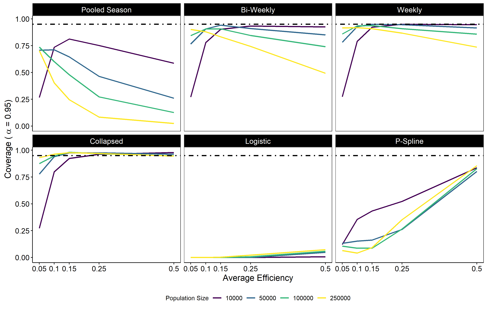

class: inverse, center, middle

# Smolt Estimation and Analytics


## Session 2

.large[Ryan N. Kinzer | Smolt Monitoring Workshop | 6th & 7th November 2019]

---

<!-- background-image: url(index.png) -->
<!-- background-position: 50% 125% -->
<!-- background-size: 25% -->
<!-- layout: true -->
---

```{r setup, include=FALSE}
knitr::opts_chunk$set(echo = FALSE)

library(tidyverse)
library(DT)
library(knitr)

```

class: center, middle

# Why?

---
class: center, middle
# To Learn

---

# When science goes awry...

--
.right[
# ...or we get lazy.
]

--

Lincoln-Peterson Equation:

$$ 
\hat{N} = \frac{C * M}{R}
$$
```{r}
df <- tibble(C = c(500, 1000),
             M = c(400, 50),
             R = c(200, 5),
             Day = c(100, 100),
             Size = c('Small', 'Large')
             )
```

--

.pull-left[
## Data
```{r}
df %>% select(C, M, R) %>% datatable(options = list(dom = 't'))
```
]

--

.pull-right[
## Which is correct?

$$\hat{N} = \frac{500 * 400}{200} + \frac{1000 * 50}{5} = 11,000$$
$$\hat{N} = \frac{600 * 450}{205} = 3,293$$

]

---

class: middle, inverse

## Would it matter if...

--

.center[
the groups were captured on <u>different days</u>, 
]

--

.center[
the groups were captured on the <u>same day</u>, 
]

--

.center[
or, what if they were from <u>different size classes</u>.
]


---

## Purpose of this Session

.left[
Learn from our colleagues
]

--

.left[
Learn from our invited experts
]

--

.left[
Learn from our mistakes
]
.center[

]


---

class: inverse, middle, center

# Accurate and Precise Estimates

---
## Imnaha River MY18 Smolt Data


---

## Imnaha River Results

```{r}
load('../data/analyst_results.rda')
```

.pull-left[
<br>
```{r}
 df %>% select(analyst, strata, captures, marks, recaptures) %>%
  mutate_if(is.numeric, round) %>%
  arrange(desc(analyst)) %>%
  datatable(rownames = FALSE, width = '100px',
            options = list(dom = 't',
                            columnDefs = list(list(targets = c(0:4), className = 'dt-center')),
                            initComplete = JS(
                              "function(settings, json){",
                              "$(this.api().table().header()).css({'font-size': '50%', 'background-color':'#000',
                              'color':'#fff'});",
                              "}")
                            )
             ) %>%
  formatStyle(columns = c(1:5), fontSize = '50%')
```
]

.pull-right[
<br>

]

---
## Simulated  Outmigrant Data


---
## Simulation - 1000 Data Sets

.pull-left[
.large[Parameters]
- Population Sizes
  - 1,000
  - 50,000
  - 100,000
  - 250,000
  
- Average Efficiency
  - 0.05
  - 0.10
  - 0.15
  - 0.25
  - 0.50

- Marking Rate
  - 100%
]

--

.pull-right[
.large[Analyzed with Submitted Methods]

- Baily Modification ($\ge$ 7 recaps)
  - Pooled Season
  - Bi-weekly strata
  - Weekly strata
  - Collapsed days
  
- Modeled Efficiency Logistic Regression (Daily)
- GAM with P-Spline (Daily)
]

---

## Estimator Bias


---

## Estimator Variability


---

## Estimator Coverage (alpha = 0.05)



---
class: inverse, center, middle

# Questions

<!-- --- -->
<!-- ## Differences -->
<!--   - Exclude Recaptures -->
<!--   - Size Classes -->
<!--   - Life Stages and Calendar Dates -->
<!--   - Interpolation -->

<!-- ## Questions -->
<!--   - Did anyone truncate dates for smolt abundance? -->
<!--   - Did anyone interpolate catch for non-operational days? -->
<!--   - Did anyone stratify; efficiency, days, flow, other? -->
<!--   - Did anyone model efficiency based on a covariate; flow potentially -->


  
<!-- ## Session Outline -->
<!-- - Bruce Barnett and Tim Copeland (IDFG) -->
<!-- - John Rohrback (CTCR) -->
<!-- - Lora Tennant (NPT) -->
<!-- - Carrie Crump (CTUIR) -->
<!-- - Jeremy Henderson (ODFW) -->
<!-- - (WDFW) -->
<!-- - Wrap Up -->
<!-- - Tim Ressegiue (YNF) -->
<!-- - Martin Liermann (NOAA) -->
<!-- - Dan Rawding (WDFW) -->
<!-- - Open Discussion -->

<!-- - Understand Differences and Reasons -->
<!-- - Find Consistencies. Are the numbers comparable? -->
<!-- - How does our differences affect other metrics and managment decisions? -->
<!-- - Can we improve? Should we recommend improvements, do we need to demand change? -->

<!-- ## Estimator Summary -->
<!--   - Time or Efficiency Stratification -->
<!--     - Stratified Chapman (Volkhardt 2007) -->
<!--     - Stratifed Baily with Parametric Bootstrap CIs (Steinhorst et al. 2004) -->
<!--   - Modeled Efficiency -->
<!--     - Logistic Regression -->
<!--     - Bayesian P-Spline Model (Bonner and Schwarz 2011) -->
<!--     - Multi-Year Bayesian Mark-Recapture (Oldemeyer et al. 2018) -->

<!-- ## Abundance Estimation -->
<!-- - Index or Trend? -->
<!-- - Absolute Abundance? -->

<!-- - Does a negative or postive bias matter? -->
<!-- - Should the error be minimized--at what cost? -->
<!-- - What is the risk for decision making? -->

